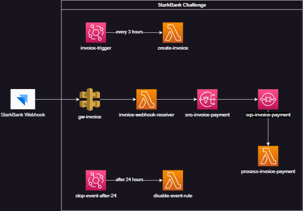

# StarkBank Challenge

## Overview

This project is developed as part of the StarkBank Challenge. The goal is to create an integration that generates invoices every 3 hours, processes invoice payment webhooks, and transfers the received amount (after deducting fees) to the Stark Bank account.

## Challenge Requirements

1. **Invoice Creation**: 
    - Issue 8 to 12 invoices every 3 hours for a total of 24 hours.
    - Invoices are sent to random people in the StarkBank Sandbox environment.

2. **Payment Handling**:
    - Receive webhook callbacks when invoices are paid.
    - Transfer the invoice amount (minus fees) to the following account:
        - **Bank Code**: 20018183
        - **Branch**: 0001
        - **Account**: 6341320293482496
        - **Account Name**: Stark Bank S.A.
        - **Tax ID**: 20.018.183/0001-80
        - **Account Type**: Payment

## Architecture

The solution is built using AWS services and consists of several components:
- **EventBridge**: Triggers the invoice creation Lambda every 3 hours.
- **Lambda Functions**: 
    - `create-invoice`: Generates 8-12 invoices at each interval.
    - `invoice-webhook-receiver`: Receives webhook notifications from StarkBank when an invoice is paid.
    - `process-invoice-payment`: Processes the payment and triggers a transfer to the Stark Bank account.
- **API Gateway**: Handles incoming webhook requests.
- **SNS & SQS**: SNS topic forwards the webhook data to an SQS queue, from where the `process-invoice-payment` Lambda retrieves it.

## AWS Architecture Diagram



## Setup Instructions

### Prerequisites

- **AWS Account**
- **StarkBank Sandbox Account**
- **Terraform**
- **.NET 8 SDK**

### Installation Steps

Follow the steps below to set up and run the project:

1. **Generate Public and Private Keys:**
   - You will need to generate a public-private key pair to authenticate with StarkBank Sandbox. Use the following commands to generate the keys:
     https://starkbank.com/faq/how-to-create-ecdsa-keys

2. **Create a StarkBank Sandbox Project:**
   - Go to the [StarkBank Sandbox](https://sandbox.starkbank.com) and create a new project using the **publicKey.pem** file you just generated.
   - Once the project is created, copy the **Project ID** that was generated.

3. **Update Terraform Variables:**
   - In the `variable.tf` file of the project, update the variable `starkbank_project_id` with the Project ID you just copied from the StarkBank Sandbox:
     ```hcl
     variable "starkbank_project_id" {
        default     = "PASTE YOUR PROJECT ID"
        description = "Project ID"
        }
     ```

4. **Update AWS Credentials:**
   - Open the `~/.aws/credentials` file and add your AWS credentials:
     ```ini
     [default]
     aws_access_key_id = YOUR_ACCESS_KEY
     aws_secret_access_key = YOUR_SECRET_KEY
     region = sa-east-1
     ```
     Note: The ~/.aws/credentials folder is typically created automatically during the installation and configuration process of the AWS CLI using the aws configure command. If this folder or file does not exist, you can create them manually and add your credentials.

5. **Publish .NET Projects and Compress Files for Deployment:**
   - Run the buildall.bat script located in the challenge-bank repository. This script compiles the .NET projects and compresses the files for deployment. It internally calls a PowerShell script named copileandpublish.ps1, which handles the project compilation and generates the ZIP files required for deployment.

6. **Deploy with Terraform:**
   - Initialize and apply the Terraform scripts to deploy the AWS resources:
     ```bash
     terraform init
     terraform plan
     terraform apply
     ```

7. **Upload the Private Key to S3:**
    - After the deployment is complete, navigate to the S3 bucket `techchallenge-starkbank` created by Terraform.
    - Upload the **privateKey.pem** to the bucket for secure access by the application.

8. **Update Webhook URL StarkBank:**
    - After the deployment is complete, navigate to the API GW `api-gateway-invoice` created by Terraform.
    - Retrieve the URL from the API Gateway and update the webhook settings in StarkBank to ensure proper reception of callback events.

## Running the Application

Once deployed, the application will:
- Automatically issue invoices every 3 hours.
- Listen for webhook notifications on payments.
- Process payments and make the necessary transfers to the StarkBank account.

### Monitoring and Logging

Use **AWS CloudWatch** to monitor Lambda functions and check logs for any issues.
